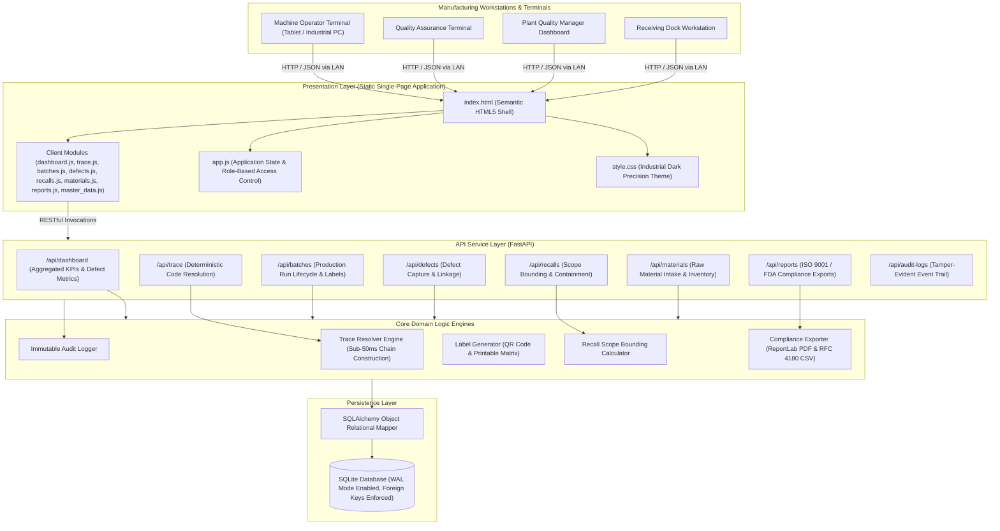
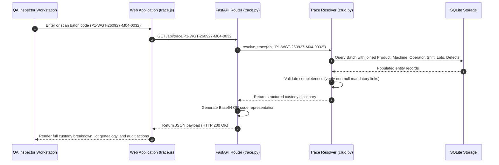
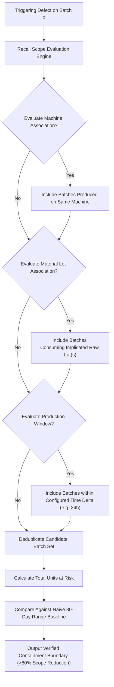

# TraceGuard System Architecture & Operational Workflows

## 1. High-Level System Architecture

TraceGuard is structured as a modular client-server web application deployed on local manufacturing plant infrastructure. It eliminates third-party cloud dependencies and dedicated IoT hardware, collecting verified data through client browser workstations and USB keyboard-wedge barcode readers.



---

## 2. End-to-End Operational Lifecycle

TraceGuard guarantees traceability by construction. Production runs cannot be closed without establishing verified associations between the machine, operator, shift, product, and consumed raw-material lots.

```mermaid
flowchart LR
    subgraph Stage1["1. Raw Material Intake"]
        A1["Material Delivery"] --> A2["Receiving Clerk Registration"]
        A2 --> A3["Generate QR Bin Tag (e.g. SL-2291)"]
    end

    subgraph Stage2["2. Production Execution"]
        A3 --> B1["Operator Opens Run (Station M04, Shift B, Lot SL-2291)"]
        B1 --> B2["Deterministic Batch Code Issued (P1-WGT-260927-M04-0032)"]
        B2 --> B3["Batch Close-Out (Recorded Quantity: 340 Units, Run Notes)"]
        B3 --> B4["Generate Printable QR Batch Label & Unit Serials"]
    end

    subgraph Stage3["3. Defect Discovery & Auto-Trace"]
        B4 --> C1["Defect Identified on Unit / Assembly"]
        C1 --> C2["Scan Batch Code into Quick Trace Interface"]
        C2 --> C3["Trace Resolver Queries Multi-Table Custody Graph"]
    end

    subgraph Stage4["4. Containment & Regulatory Audit"]
        C3 --> D1["Identify Root Cause (Machine M04 + Material Lot SL-2291)"]
        D1 --> D2["Recall Calculator Computes Precise Affected Units"]
        D2 --> D3["Authorize Containment Quarantine Event"]
        D3 --> D4["Export ISO 9001 / FDA 21 CFR Part 820 Audit Package"]
    end
```



---

## 3. Component Interaction Sequence: Trace Resolution

This sequence demonstrates how a QA Inspector scans a defective unit and receives the complete custody chain in sub-50ms execution time.



---

## 4. Recall Scope Bounding Logic

Rather than issuing date-range blanket recalls that scrap uncontaminated inventory, the Recall Calculator bounds candidate batches based on shared vulnerability criteria:



---

## 5. Repository Layout and Component Directory

```
/home/yash55-max/projects/new/
├── app/
│   ├── crud.py              Data access operations, trace resolution, and recall calculations
│   ├── database.py          SQLAlchemy engine setup with SQLite WAL mode and foreign key pragmas
│   ├── labels.py            Deterministic batch code generation, checksums, and QR matrix generator
│   ├── main.py              FastAPI application entrypoint, CORS configuration, and router assembly
│   ├── models.py            SQLAlchemy relational models matching architecture ER specifications
│   ├── reports.py           ReportLab PDF audit generator and RFC 4180 CSV export routines
│   ├── schemas.py           Pydantic request and response models enforcing data integrity
│   ├── seed_data.py         Reference factory data loader populating plant baseline entities
│   └── routers/
│       ├── audit.py         Endpoint exposing tamper-evident immutable audit log entries
│       ├── batches.py       Endpoints for production run initiation, close-out, and label retrieval
│       ├── dashboard.py     Endpoint serving aggregated plant KPIs and distribution metrics
│       ├── defects.py       Endpoints for defect capture, listing, and status transitions
│       ├── master_data.py   Endpoints managing machines, operators, shifts, products, suppliers
│       ├── materials.py     Endpoints for raw material intake and warehouse bin tagging
│       ├── recalls.py       Endpoints for recall scope calculation and containment authorization
│       ├── reports.py       Endpoints for streaming audit-grade compliance reports
│       └── trace.py         Endpoint for instant batch and serial custody resolution
├── static/
│   ├── css/
│   │   └── style.css        Production dark theme styling matching plant reference design
│   ├── js/
│   │   ├── app.js           Application state, client navigation, and notification management
│   │   ├── batches.js       Batch start/close workflows, validation, and label rendering
│   │   ├── dashboard.js     KPI metrics rendering, horizontal bar charts, and defect table
│   │   ├── defects.js       Defect intake dialog, auto-trace preview, and containment status
│   │   ├── master_data.js   Administrative interface for plant master data management
│   │   ├── materials.js     Raw material receiving intake and warehouse inventory tracking
│   │   ├── recalls.js       Interactive recall scope calculator and event logging
│   │   ├── reports.js       Audit export controls and immutable event history table
│   │   └── trace.js         Visual custody chain inspection, QR modal, and export triggers
│   └── index.html           Semantic, single-page application shell
├── data/
│   └── traceguard.db        SQLite database file persisted in Write-Ahead Logging mode
├── Dockerfile               Single-container containerization specification
├── docker-compose.yml       Production compose deployment for on-prem plant hosts
├── requirements.txt         Python dependency manifest
├── run.sh                   Self-contained environment bootstrapping and startup script
├── SYSTEM_ARCHITECTURE.md   System architecture, sequence diagrams, and technical specifications
└── README.md                Project documentation, deployment instructions, and API reference
```
