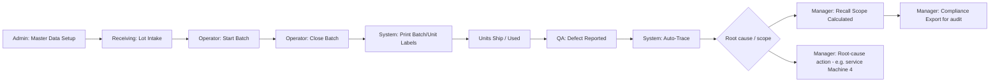

# App Flow — TraceGuard

This document walks through each role's journey end to end. Screens referenced here are specified in `design.md`.

## 0. Overall Flow Map

## 1. Admin — Master Data Setup (one-time / ongoing)

1. Log in as Admin.
2. Add **Machines** (code, name, location).
3. Add **Operators** (name, badge ID) and **Shifts** (name, time window).
4. Add **Products** (SKU, name, spec).
5. Add **Suppliers** (name, contact).
6. Create user accounts for Operators, QA, Managers, Receiving Clerks with the correct role.

*Outcome:* the dropdowns every other role relies on are populated, so nobody free-types a machine or supplier name (which is exactly what breaks traceability today).

## 2. Receiving Clerk — Raw Material Lot Intake

1. Log in; open **Log Incoming Material**.
2. Select supplier, enter lot code (or scan the supplier's label), quantity, received date.
3. If the supplier didn't provide a printable code, click **Generate Lot Label** — the system prints a QR-coded label.
4. Submit → lot is now selectable by operators starting a batch.

## 3. Operator — Start a Batch

1. Log in; open **Start Batch**.
2. Select machine (defaults to the station's assigned machine if configured), product, current shift (defaults to today's shift), and the raw-material lot(s) being consumed (scan or pick from active lots).
3. Click **Start** → system stamps start time and issues a **Batch Code**.
4. Operator runs production as normal.

*Design constraint:* this form must take under a minute — every extra field is a reason operators skip it.

## 4. Operator — Close a Batch

1. Open **Close Batch**, select the active batch (or scan its code from a posted station tag).
2. Enter quantity produced and any notes (e.g., "brief stoppage 10:15–10:22").
3. Submit → system stamps end time, marks the batch complete, and offers **Print Labels** (batch label and/or per-unit labels, each a QR of the Batch Code).
4. Labels are affixed to cartons/units on the line — this is the only new physical step added to the existing process.

## 5. QA Inspector — Defect Report & Auto-Trace

1. A defective unit surfaces (customer return, in-line QA check, etc.).
2. QA opens **Report Defect**, scans or types the unit/batch code from the label.
3. System resolves the code instantly and displays the **full chain of custody**: product, machine, operator, shift, exact time window, and every raw-material lot (with supplier) used in that batch.
4. QA selects defect type, severity, and description, and submits.
5. The defect is now linked to the batch and visible on the dashboard and to the assigned Manager.

*This is the moment that used to require guesswork; it's now a single scan.*

## 6. Manager — Recall Scope Calculation

1. Open the defect from the dashboard's **Open Defects** list.
2. Click **Calculate Recall Scope**.
3. Choose which shared attributes define the risk: same machine, overlapping time window, and/or same raw-material lot (any combination).
4. System returns the precise list of affected batch codes and total quantity at risk.
5. Manager reviews, adjusts criteria if needed, and confirms the recall — creating a **Recall Event** record with status tracking (Initiated → In Progress → Closed).

## 7. Manager — Root-Cause Follow-Up

1. From the **Dashboard**, review defect rate broken down by machine and by raw-material lot.
2. A spike on one machine or one supplier lot is now visible directly, without cross-referencing spreadsheets.
3. Manager schedules maintenance, requalifies a supplier lot, or retrains a shift — and logs the action as a note against the machine/lot for future audit trail.

## 8. Manager/Admin — Compliance Export

1. Open **Reports**.
2. Choose scope: a single batch, a date range, or a specific recall event.
3. Choose format (PDF for auditors, CSV for internal analysis).
4. Export includes the full chain of custody for every included batch, timestamped and attributable — ready to hand to an ISO 9001 or FDA auditor.

## 9. Exception Path — Missing/Incomplete Trace Data

If a batch is somehow closed with an incomplete trace (should be structurally prevented, but flagged as a safety net):

1. Dashboard's **Traceability Completeness** KPI drops below 100% and highlights the specific batch(es).
2. Manager or Admin can open the batch and backfill the missing field if it's recoverable (with the correction logged in the audit trail as a correction, not a silent edit).
3. If unrecoverable, the batch is flagged so any future recall calculation treats it conservatively (included by default rather than excluded).
