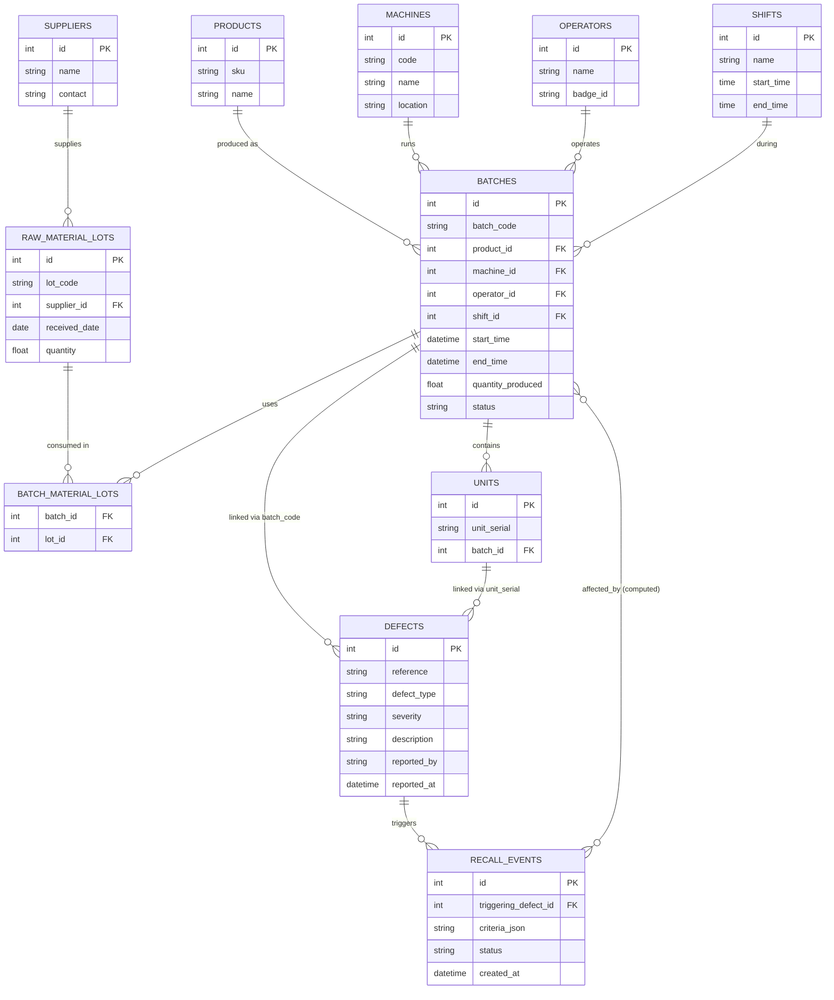
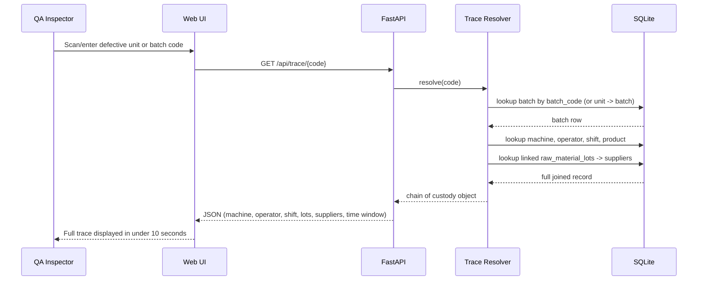
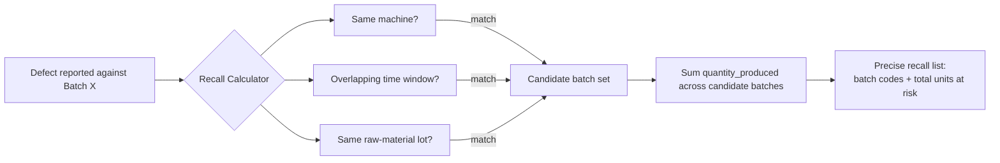
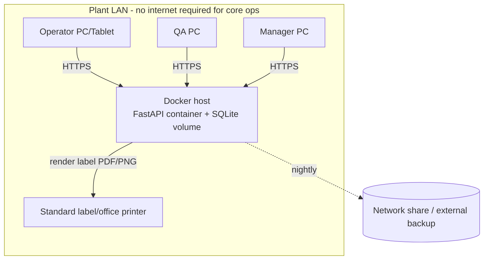

# Architecture — TraceGuard

## 1. High-Level Architecture

```mermaid
flowchart TB
    subgraph Client["Shop-Floor & Office Browsers"]
        A1[Operator Station]
        A2[QA Inspector Station]
        A3[Manager Dashboard]
        A4[Receiving Clerk Station]
    end

    subgraph Server["Factory-Floor Server (on-prem / local VM)"]
        B1[Static HTML/CSS/JS]
        B2[FastAPI Application]
        B3[Auth & RBAC Middleware]
        B4[Business Logic\n(Trace Resolver, Recall Calculator)]
        B5[SQLAlchemy ORM]
        B6[(SQLite Database)]
        B7[Label/QR Generator]
        B8[Report Generator\nPDF/CSV]
        B9[Audit Logger]
    end

    A1 & A2 & A3 & A4 -->|HTTPS - LAN| B1
    B1 --> B2
    B2 --> B3
    B3 --> B4
    B4 --> B5
    B5 --> B6
    B4 --> B7
    B4 --> B8
    B4 --> B9
    B9 --> B6

    B6 -.nightly backup.-> C1[(Local/Network Backup)]
```

No external cloud service, sensor network, or IoT gateway is part of this system. The entire stack runs on infrastructure the plant already has (a PC/small server on the local network) and standard browsers.

## 2. Component Responsibilities

| Component | Responsibility |
|---|---|
| Static frontend | Renders forms (batch start/close, defect log, receiving intake) and the dashboard; talks to the backend only via the documented JSON API |
| FastAPI application | Request routing, validation (Pydantic), authentication |
| Auth & RBAC | Confirms identity, enforces per-role permissions (Admin/Operator/QA/Manager/Receiving) |
| Business logic layer | Two critical functions: **Trace Resolver** (code → full chain of custody) and **Recall Calculator** (defect criteria → affected batch set) |
| SQLAlchemy ORM | DB-agnostic data access layer; enables SQLite-to-Postgres migration without rewriting business logic |
| SQLite database | System of record; single file, WAL mode for concurrent writers |
| Label/QR generator | Produces batch and lot labels as printable PNG/PDF via the browser print dialog |
| Report generator | Produces compliance/audit exports (PDF/CSV) |
| Audit logger | Appends an immutable record of every create/update/delete, with actor and timestamp |

## 3. Data Model (ER Diagram)



## 4. Trace Resolution Flow (the core function)



## 5. Recall Scope Calculation Flow



This replaces "recall everything made in the last month" with a computed, defensible, minimal set.

## 6. Deployment View



## 7. Security & Access Model

- Role-based access control at the API layer: Admin, Operator, QA Inspector, Manager, Receiving Clerk.
- Every mutating request is authenticated and written to the append-only `audit_log`.
- TLS on the LAN connection between browsers and the server.
- No external network egress required for the application to function, minimizing attack surface — consistent with the "no IoT devices" constraint, since there is no device-to-cloud channel to secure.

## 8. Why This Architecture Satisfies the Constraint

- **No IoT devices:** every data point enters the system through a human using a browser form (optionally accelerated by a USB barcode scanner, which behaves as a keyboard, not a network device).
- **Simple stack:** static HTML/CSS frontend, FastAPI backend, SQLite database — no message brokers, no device gateways, no cloud dependency.
- **Traceability by construction:** the schema makes it structurally impossible to close a batch without recording machine, operator, shift, and raw-material lot, which is the actual fix for the root problem in the prompt.
